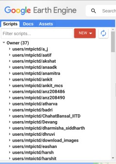
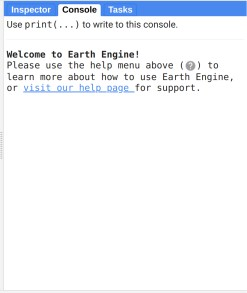

Hi, Welcome to the tutorial!

This tutorial is divided into two parts:
1. Working
2. Practice         

It is recommended to look at the working before moving to the Practice. The tutorial uses java script but APIs are similar in both python and java script.
Let's Learn.

## Set Up
         
This image shows all the repositories of different users at lab. Set your own repo by clicking on new button. 
The right side of the page contains console and tasks tab.          
          
When you run your code, you can look at the output on console tab. To look at the tasks, you can click on tasks tab.            


# Working Part 1
1. Google Earth Engine is a distributed computing Engine with Integrated Database.     
2. It stores around Petabytes of data which is related to many climatic and landscape variables. Any computation which is performed on this data is also called Geocomputing.  
3. Just a quick overview of distributed engine : Distributed engines can speed up your computation (if used correctly). These engines on backend divide your computation among thousands of remote machines. In case of Google these machines are own by Google itself. After each remote machine perform their respective computation, they return the final output to Google master server. (Master server refers to the device which is handling the disitribution of compuation among all the remote machines).    
4. Earth Engine also has a large database which could be used to load images which are related to your analysis.    
5. It is important to write the code in such a way that can instruct the Master server to distribute your code across its remote machines. We can't directly use for loops to perform expensive computations. You will have to explicitly use the APIs of Google Earth Engine to serve this purpose.


# Working Part 2

Now, we look at the code of Earth Engine and step by step understand what would be happening in the background. 
To make the script in Google Earth Engine refer to Practice section.    
This code is written in Java Script on code.earthengine.google.com.

## Example Code     
```
var collection = ee.ImageCollection("LANDSAT/LC08/C02/T1_L2");
```

In this code snippet, we are using inbuilt dataset of GEE 'Landsat'. 'ee' is used for calling earth engine library. ImageCollection is a constructor which takes the path of Dataset you want to load.          

Each element in this image collection represents an image. GEE provides a wrapper over every data it stores and this abstraction is called as object or more specifically container. Every Image or an Image collection is stored as a dictionary. This dictionary would be referred as an object.  

Each object has some attributes (which could be referred as Meta Data) and actual data as keys.     

You can also use the methods provided by GEE to manipulate an object (Image or Image Collection) in several ways.   

Typically these manipulations could be expensive. For eg., Your are asked to normalize each image in this Image collection, so that each pixel values are mapped between 0 to 1.        

What could be the most basic way to solve this task?    
1. If you think this Image Collection as dictionary, we can iterate over all the keys of this Image Collection. The keys of this Image Collection would be Images. 
2. And in every iteration, you take the key, and for each pixel, divide the value of pixel by its maximum possible value.
3. Any iteration could be done by a for loop.

But this method could be very slow to perfom any analysis even at a state level. Let us understand what would happen if you use above algorithm to perform this. 

Remember that when you use the standard java script to perform the computation, all the data required to perform this computation is first collection to your device and then computed locally. So, one thing is clear, we can't just use for loop to do this. The size of this Image Collection is more than 1 TB!     

Let's now see, how we can use Earth Engine at its fullest :     
1. We redesign this algorithm to use distributed computing.
2. We think this task of performing normalization on each image as a manipulation on Image Collection. 
3. GEE provides a different programming way to perform this manipulation in a distributed fashion.
4. To perform this manipulation over Image Collection, we need to manipulate each image so that all pixels are normalized.  
5. To manipuate large Collections in a distributed fashion, GEE provides methods like map and reduce. 

### Map Method For ImageCollection
Abstractly, map is a higher-order function that applies a given function to each element of a collection. This definition inherently allows the computation to be done in distributed way. Most of the computations which would done in lab will involve this method to be executed.

This method takes as input an Image Collection and a custom function which should act on each element of Image Collection.   

When we run this method on any Image Collection, Earth Engine Master Server will perform this computation on its own server and no dataflow would take place between your browser and master server. Also, the server(master) will distribute the images between its remote machines to apply custom function on each image. Each remote machine after executing function on image, return new image which will be sent back to Master server.      

Now, we also have to write a function which should be passed as input for this Map method.   

What should this function do? It should manipulate the Image (base object of Image Collection). 

```
var manipulate_base_object = function(base_object){
    return base_object.divide(255);
}
var manipulated_collection = collection.map(manipulate_base_object)
```

The above code performs the task without using any for loop and using the Earth Engine at its full.     

Remember that any object of Earth Engine can only be manipulated by the methods of that object provided by Earth Engine.
In our case, to normalize the image, we need to use its method (.divide(255)) which divides each pixel by 255 and returns a new image.      

Now Let's click on run button. This task will be completed just in milliseconds!! Why?? This Image Collection size is more than 1 TB. Even after distributing this is not possible only with thousand remote machines.      

What's actually happening?      
When you click on run button, it does not execute this code. 

Why Earth Engine do this?       
Clicking on 'Run' button and looking at the output on console is referred as Interactive computation. Earth Engine assumes that these type of computation are only performed for debugging purposes and are not optimized for performing computation on large input.  
Hence, if you not print something related to that computation, it will not execute it.      

Let us change the above code to print the output of first image :       
```
var manipulate_base_object = function(base_object){
    return base_object.divide(255);
}
var manipulated_collection = collection.map(manipulate_base_object);
print(manipulated_collection.first());
```

As we can see that we are only printing first image after transformation. When we click on run button, GEE will only execute the computation on first image and saves the time and resources.       

So, How to save the Image Collection after transformation?      
GEE refers to these computations as Batch Computation. Batch Computation is performed after you complete your debugging. To use batch computation, you need to explicitly instruct the GEE to run this part of computation in Batch mode.       

To perform this batch computation, we add the following line in our script :        
```
ee.Export.image.toDrive('drivepath');
```

You need to call this function on each image. Therefore, we can use map to call this.   
```
var export = function(image){
    ee.Export.image.toDrive('drivepath');
    return image;
}
var exported = manipulated_collection.map(export);
```

Now, this part of computation will be sent to Batch computation server. Batch Mode is optimized to perform computations on very large input data.   

GEE will make a task out of this computation. You would be able to look at this task in tasks tab.   

### Note 
1. All the objects in Earth Engine are immutable. This means that you can't change the data of object once you have created it. To us, it is relevant in the sense that every method shoud return the new object. Therefore you can never run a method in this fashion : 

```
collection.map(custom_function)
```

This is because collection is already constructed. You can't just transform this specific object. You need to use a new object to use the transformed Image Collection. So we use :         
```
var new_collection = collection.map(custom_function);
```

2. All the objects of GEE acts as container. When you print any object, it will only print the meta data of that object. GEE does this to reduce unnecessary dataflow traffic. If you need any data explicitly, you should use :        

```
print(image.getInfo());
```

Although, this is not recommended.      

### Important To Remember       
Sometimes we forget that objects of GEE can only be manipulated by the methods of that object otherwise can result in inaccurate results or slow execution.         

For eg.,        
You have a Earth Engine Feature Collection object(Feature Collection objects are collection where keys are feature object. You can consider each feature object as a dictionary in itself which can be used to store many arbitrary attributes. We explain the creation of features after this discussion).


Each Feature Object contain a single attribute which shows the timestamped year on which it was added to the database. Now, you want to filter out all the features into a new collection with features added after 2022. 

For this purpose, we can use the 'filter' method on Feature Collection which filters the features with a certain attrbiute in a distributed fashion.  

Let us assume that each timestamp is a number. Therefore to filter out, you write the code :        

```
var filtered_collection = collection.filter('timestamp'>2022);
```

Will it work?  
No, This is because, the type of value stored as a timestamp is not a javascript number. So, you can write expressions as shown in above code.          

This timestamped year is actually a ee.Number object. Hence to perform any calculation related to this, we need to write :      

```
var filtered_collection = collection.filter('timestamp'.gteq(2022));
```

You can check the Earth Engine docs to look at all the methods it provide for ee.Number class.  


### Filter Method : 
This method is derived method of Map function i.e., It is possible to make our own filter method just by using Map method (Think about it).     
GEE provides some inbuilt Filters like FilterDate method that uses the range of date to filter out the images which were stamped with time between the range. All these methods are also derived methods.       


### Reduce Method :         
A reduction operation is a function that reduces a dataset to a smaller set, usually a single item.      

How this operation can be useful?      

Suppose you are given a task to analyse the temperature of a state. You want to look at the average temperature of this state across all the months in a year.  So you need to perform a reduce operation on an Image collection where each image represents the pixelwise temperature of that state for a particular day. This operation should output a single image that represents pixelwise average temperature across the year for that state.        

The custom function which represents the way you want to reduce this ImageCollection (In our case this custom function would be to take average) is called Reducer.         

Typically, GEE provides some default Reducers. In most of the cases, its sufficient to use these Reducers except somecases where you can define custom Reducers like we had defined our custom Mappers.  

The code for the reduce task, we discussed looks like:      

```
var temperatureCollection = ee.ImageCollection("NASA/GLDAS/V021/NOAH/G025/T3H").filterBounds(yourRegion) .filterDate('YEAR_START', 'YEAR_END');
var reducer = ee.Reducer.mean();
var averageTemperature = temperatureCollection.reduce(reducer);
```

Here you use the GEE provided reducer 'mean'.


## Recommendation
Most of us before using GEE, implements the algorithm in most intuitive programming way. But while programming using GEE, it is recommended to implement your program using Map Reduce operations (or thier derived methods) to increase the performance.

We look at some particular objects in next part.        

# Working Part 3

## ee.Image

This object can be considered as an dictionary which holds the data of pixel wise values with some other meta data as attributed.       

Analogous to images, ee.Image can also store multiple 2-D arrays. Each 2-D array is called a band. There could be several bands in just a single image. Each ee.Image object provides several methods to execute some popular image operations very efficiently (possibly in distributed manner in cases of Large Images). Each Attribute (meta data) of this Image is itself an object. It could be an Image itself, Image Collection, Feature, Feature Collection, ee.Number or ee.String. Image can be considered an derived object of Feature class.

### Side Note :
Whenever you print an object, it prints the meta data of that object along with meta data of the base object. 

### Feature : 
Feature object only contains attributes. These attributes can also be any object. In similar fashion,  It could be an Image itself, Image Collection, Feature, Feature Collection, ee.Number or ee.String.

### Heirarchy of Objects : 

Let us look at the typical structure of an Image Collection.            

Image Collection        
|               
|__ 'Size' (ee.Number contains 5000)        
|       
|__ 'Image0', 'Image1' ....     

Image0      
|           
|__ 'Height' (ee.Number)       
|__ 'Width'  (ee.Number)        
|__ Geometry (Feature)              
|__ 'First 2D array representing temperature' (data)    
|__ 'Second 2D array representing Vegetation Index' (data)


### ee.Geometry
GEE provides some special feature that are used very frequently. The first one we have already seen at is ee.Image. Earth Engine also provides ee.Geometry which can be used to perform some complex operations related to geometry of Image. Each ee.Image object has an associated ee.Geometry object. 


# Practice
You can now try out some small tasks to get started with GEE. 
1. Choose an Image COllection from Earth Engine Catalogs. Analyse the structure of that Image Collection.


After this tutorial, you are good enough to understand the advance thigs related to GEE. You can look at the https://developers.google.com/earth-engine/guides for more. 

Thank you for reading.

